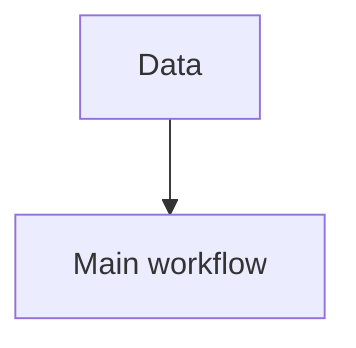

# Workflow Card: <paper title>

## 0. Bibliographic Info

- Title:
- Year:
- Journal:
- DOI / PMID:
- Zotero Item Key:
- BibTeX Key:
- Study object:
- Cancer / disease context:
- Data types:

## 1. Core Scientific Question

## 2. Main Claims

| Main claim | Evidence strength | Core claim? |
|---|---|---|
|  | strong / medium / weak | yes / no |

## 3. Evidence Foundations

### 3.1 Data Credibility

### 3.2 Cell Identity

### 3.3 Main Conclusion

## 4. Does Data Choice Support the Main Workflow?

| Question | Judgment |
|---|---|
| Are data sources suitable for the core question? |  |
| Are sample types matched to the workflow? |  |
| Are platforms suitable for integration? |  |
| Is metadata sufficient? |  |
| Which data support discovery? |  |
| Which data support validation? |  |
| Biases or gaps? |  |

Data support rating: strong / medium / weak / unable to determine

## 5. Main Workflow Type

## 6. Workflow Trunk

```text
data -> QC -> integration -> annotation -> main discovery -> validation
```

| Step | What the authors did | Purpose |
|---|---|---|
| Data |  |  |
| QC |  |  |
| Integration |  |  |
| Annotation |  |  |
| Main discovery |  |  |
| Validation |  |  |

## 7. Branching, Parallel, or Convergent Logic



## 8. Downstream Modules

| Module | Method | Purpose | Supports which claim |
|---|---|---|---|
|  |  |  |  |

## 9. Evidence Chain

| Main claim | Supporting modules | Evidence type | Sufficient? |
|---|---|---|---|
|  |  |  | strong / medium / weak |

## 10. Key Technical Choices

| Decision point | Authors' choice | Alternatives | Why suitable here | Assumption or risk | Impact on claim |
|---|---|---|---|---|---|
| Data integration |  |  |  |  |  |
| Annotation strategy |  |  |  |  |  |
| Differential analysis |  |  |  |  |  |
| Trajectory or lineage |  |  |  |  |  |
| Communication analysis |  |  |  |  |  |
| Clinical validation |  |  |  |  |  |

## 11. Why This Workflow Was Necessary

## 12. Counterfactual Workflow Risk

| Alternative workflow | What it might capture | What it might lose | Potential bias |
|---|---|---|---|
|  |  |  |  |

## 13. Reusable Design Principle

Reusable Design Principle:

## Notes and Uncertainties

- Unable to determine:
- Needs full text / supplement / code:
